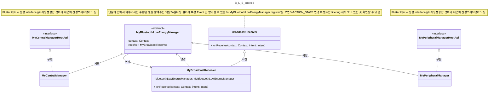

# Bluetooth Low Energy: Android

## 1. Overview: Simplified Diagram

> 핵심적인 로직 부분을 제외한 callback class 들은 Diagram 에서 빠져있음을 주의. 이는 `2. 파일 구조` 에 설명되어 있음.



## 2. 파일 구조

> 살펴봐야할 중요도를 🌟 로 표현함.

```
├── BluetoothLowEnergyAndroid.kt
├── MyAdvertiseCallback.kt
├── 🌟 MyApi.g.kt
├── MyApi.kt
├── MyBluetoothGattCallback.kt
├── MyBluetoothGattServerCallback.kt
├── 🌟 MyBluetoothLowEnergyManager.kt
├── MyBroadcastReceiver.kt
├── 🌟🌟 MyCentralManager.kt
├── 🌟🌟 MyPeripheralManager.kt
├── MyRequestPermissionResultListener.kt
└── MyScanCallback.kt
```

### (1) BluetoothLowEnergyAndroid.kt

- Android - Flutter 연결을 위한 `entry point` 라 볼 수 있을 듯함.
- `MyPeripheralManager`, `MyCentralManager` 를 멤버변수로 사용하여 초기 설정하는 역할을 함.
- 또한, FlutterEngine 이벤트, Life Cycle에 맞춰서 권한 Listener를 때고 붙이는 하는 역할을 함.

### (2) MyAdvertiserCallback.kt

- `MyPeripheralManager` 에서 사용할 callback 클래스
    - Advertising 성공, 실패 관련 callback

### (3) 🌟 MyApi.g.kt

- flutter 인터페이스와 연결하기 위한 Android interface ([Pigeon](https://pub.dev/packages/pigeon) 으로 자동 생성함)
  - 자동 생성을 위한 template 은 [my_api.dart](https://github.com/yanshouwang/bluetooth_low_energy/blob/master/bluetooth_low_energy_android/my_api.dart) 참고
- 대부분 전달해야할 Data Type 에 대한 선언
  - 하지만 `MyPeripheralManagerHostApi`, `MyCentralManagerHostApi` 는 실질적으로 사용할 interface 가 선언되어있고 이를 `MyPeripheralManager`, `MyCentralManager` 에서 구현하니 주의해서 보기.

### (4) MyApi.kt

- `MyApi.g.kt` 파일에 선언된 Data Type <-> Bluetooth 관련 Data Type 으로 변환하는 extension 모음 파일.

### (5) MyBluetoothGattCallback.kt

- `MyCentralManager.kt` 에서 Peripheral GATT 에 연결 이후 발생하는 이벤트에 대한 callback.

### (6) MyBluetoothGattServerCallback.kt

- `MyPeripheralManager.kt` 에서 Peripheral GATT 에 연결 이후 발생하는 이벤트에 대한 callback.

### (7) 🌟 MyBluetoothLowEnergyManager.kt

- `Activity`, `단말기 이벤트` 등 Android app lifecycle 혹은 환경과 관계된 이벤트를 처리하기 위한 abstract class.
    - `MyPeripheralManager`, `MyCentralManager` 이 이를 확장한 class 이니 주의해서 보기.

### (8) MyBroadcastReceiver.kt

- `단말기 이벤트` (e.g. Bluetooth 수신, 화면 잠금 등) 를 캐치해서 처리하는 클래스.
    - filter 를 사용해서 원하는 이벤트에 대해서만 받아볼 수 있음.

### (9) 🌟🌟 MyCentralManager.kt

- Central(=Client) 관련 기능, Android Lifecycle 및 Event 에 따라 처리해야할 BLE 로직을 담고 있는 곳.
  - e.g.) startDiscovery, connect, readCharacteristic, etc.
- `MyBluetoothLowEnergyManager`, `MyCentralManagerHostApi` 를 확장 및 구체화 한 것임을 확인 하기.
  - `MyBluetoothLowEnergyManager`: Android Lifecycle 및 Event 에 대한 내용 모음.
  - `MyCentralManagerHostApi`: Central 관련 interface 모음(template에 의해 자동 생성됨)
### (10) 🌟🌟 MyPeripheralManager.kt

- Peripheral(=Server) 관련 기능, Android Lifecycle 및 Event 에 따라 처리해야할 BLE 로직을 담고 있는 곳.
  - e.g.) startAdvertising, addService, sendReadCharacteristicReply, etc.
- `MyBluetoothLowEnergyManager`, `MyPeripheralManagerHostApi` 를 확장 및 구체화 한 것임을 확인 하기.
  - `MyBluetoothLowEnergyManager`: Android Lifecycle 및 Event 에 대한 내용 모음.
  - `MyPeripheralManagerHostApi`: Peripheral 관련 interface 모음(template에 의해 자동 생성됨)

### (11) MyRequestPermissionResultListener.kt

- Bluetooth 권한 부여 여부 확인하여 결과 반환하는 Callback interface
- `MyBluetoothLowEnergyManager` 를 확장한 `MyPeripheralManager` 와 `MyCentralManager` 에서 permission 승인 결과를 사용하기 위하여 만들어진 듯 보임.

### (12) MyScanCallback.kt

- Central(=Client) 에서 Scan 1. 결과를 받았을 때, 2. 오류가 발생하였을 때 를 처리하기 위해 사용하는 callback.
- `MyCentralManager.kt` 에서 `scanCallback` 이라는 멤버 변수를 사용된 것 확인 하기.
