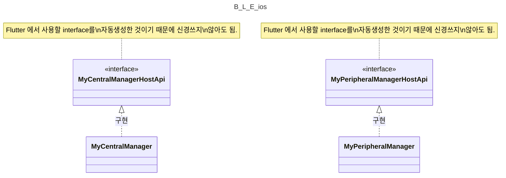

# Bluetooth Low Energy: iOS

## 1. Overview: Simplified Diagram

> 핵심적인 로직 부분을 제외한 callback class 들은 Diagram 에서 빠져있음을 주의. 이는 `2. 파일 구조` 에 설명되어 있음.



## 2. 파일 구조

> 살펴봐야할 중요도를 🌟 로 표현함.

```
├── BluetoothLowEnergyDarwin.swift
├── 🌟 MyApi.g.swift
├── MyApi.swift
├── 🌟🌟 MyCentralManager.swift
├── MyCentralManagerDelegate.swift
├── MyError.swift
├── MyPeripheralDelegate.swift
├── 🌟🌟 MyPeripheralManager.swift
└── MyPeripheralManagerDelegate.swift
```

### (1) BluetoothLowEnergyDarwin.swift

- ios - Flutter 연결을 위한 `entry point` 라 볼 수 있을 듯함.
- `MyPeripheralManager`, `MyCentralManager` 를 멤버변수로 사용하여 초기 설정하는 역할을 함.

### (2) 🌟 MyApi.g.swift

- flutter 인터페이스와 연결하기 위한 ios interface ([Pigeon](https://pub.dev/packages/pigeon) 으로 자동 생성함)
  - 자동 생성을 위한 template 은 [my_api.dart](https://github.com/yanshouwang/bluetooth_low_energy/blob/master/bluetooth_low_energy_darwin/my_api.dart) 참고
- 대부분 전달해야할 Data Type 에 대한 선언
  - 하지만 `MyPeripheralManagerHostApi`, `MyCentralManagerHostApi` 는 실질적으로 사용할 interface 가 선언되어있고 이를 `MyPeripheralManager`, `MyCentralManager` 에서 구현하니 주의해서 보기.

### (3) MyApi.swift

- `MyApi.g.kt` 파일에 선언된 Data Type <-> Bluetooth 관련 Data Type 으로 변환하는 extension 모음 파일.

### (4) 🌟🌟 MyCentralManager.swift

- Central(=Client) 관련 기능을 담고 있는 곳.
  - e.g.) startDiscovery, connect, readCharacteristic, etc.

### (5) MyCentralManagerDelegate.swift

- BLE Central 에서 발생하는 `연결관련 callback` function 을 담고 있는 class
  - android 의 `MyBluetoothGattCallback.kt` 의 callback들 일부분을 비슷하게 담고 있음.

### (6) MyError.swift

- Error 구분하기 위한 custom enum

### (7) MyPeripheralDelegate.swift

- BLE Peripheral 에서 발생하는 `데이터 교환 request에 대한 response callback` function 을 담고 있는 class
  - android 의 `MyBluetoothGattServerCallback.kt` 의 sent callback들 일부분을 비슷하게 담고 있음.

### (8) 🌟🌟 MyPeripheralManager.swift

- Peripheral(=Server) 관련 기능을 담고 있는 곳.
  - e.g.) startAdvertising, addService, sendReadCharacteristicReply, etc.

### (9) MyPeripheralManagerDelegate.swift

- BLE Peripheral 에서 발생하는 `데이터 교환 request callback` function 을 담고 있는 class
  - android 의 `MyBluetoothGattServerCallback.kt` 의 request callback들 일부분을 비슷하게 담고 있음.

